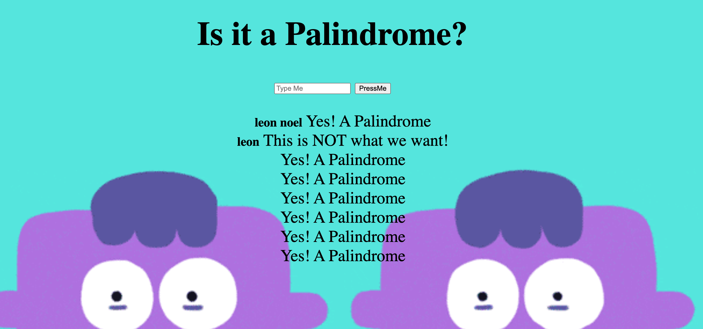

## Installation

1. Clone repo
2. run `npm install`

## Usage

1. run `node server.js`
2. Navigate to `localhost:3030`

##Background

1. This app is able to tell you what a word, phrase, or sequence that reads the same backward as forward, e.g., madam or nurses run. This was really fun to make because it required 3 array methods to do so. 4 to be politcally correct. I used the method toLowerCase() to make sure any word being passed in was lowercased . After I did the split with the '' & & no space because I wanted to seperate the string and turn it into an array. used the reverse() method to reverse the order of the array && lastly the join('') method to turn the array back into a string. Its super cool and was super easy to make. Try it out !

## Credit

Modified from Scotch.io's auth tutorial

##Languages 
#HTML #CSS #JAVASCRIPT #NODE #EJS #EXPRESS